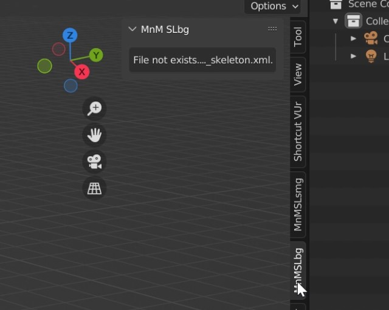
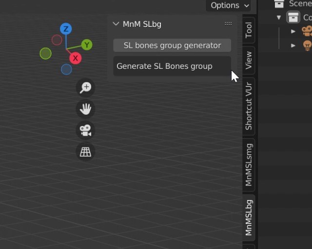
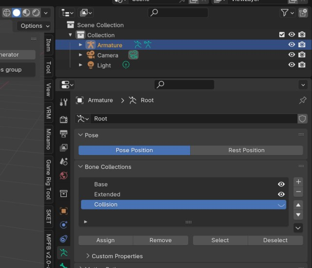

# mnmSLBoneGenerator
The Plugin for Blender. Add armature, and generate bones from Second Life bento skeleton.

Generate Base bones, Extended bones and collision volume bones, from aveter_skeleton.xml.

## Getting started
Download zip file (file name is mnmSLBoneGenerator-master.zip, maybe). ATTENTION DONT UNZIP DOWNLOAD FILE.  
Install add-ons in preferences menu. click install button and select downloaded a zip file.  
This plugin are set "testing" category. click checkbox to enabled this plugin.  

The "MnMSLbg" tab appears in 3DView Toolshelf (click N key).

Copy the aveter_skeleton.xml from Second Life viewer directory.  
You can find the aveter_skeleton.xml inside a folder like this,  
eg. C:\Program Files\SecondLifeViewer\character

Copy the aveter_skeleton.xml file to the plugin folder.  
You can find the plugin folder like this,  
eg. C:\Users\[user-name]\AppData\Roaming\Blender Foundation\Blender\3.3\scripts\addons\mnmSLBoneGenerator-master

This plugin are find the xml file and enabled generate button.

## Bone Collections (Bone groups)

Each generated bone is set in a bone collection.

Base bone is set "Base" bone collection (Blue color).  
Extended bones is set "Extended" bone collection (Green color).  
Collision volume is set "Collision" bone collection (Red color).

")

Bone collection is can toggle hide and visible on armature data property panel.

